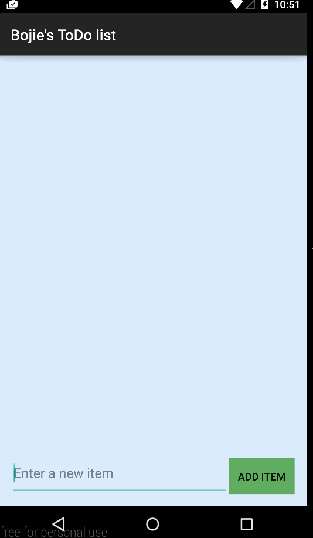

# TodoList-android

This is an Android demo application for To-do List, which can record idea fast and use daily.

Completed user stories:

 * [x] Activity XML (Layouts and Views)
 * [x] Activity Source (Java Code for App Logic)
 * [x] View IDs and Properties
 * [x] ListViews, EditText and Button View Types
 * [x] List Adapters for Displaying List Items
 * [x] Click Handling for Buttons and List Items
 * [x] Testing Applications with the Emulator
 * [x] Generate Second Screen 
 * [x] Layout Edit Form 
 * [x] Support Edit Action
 * [x] Populate Edit Form 
 * [x] Send Back Result on Save 
 * [x] Update Todo Item 
 
 GIF demo:
 
 
